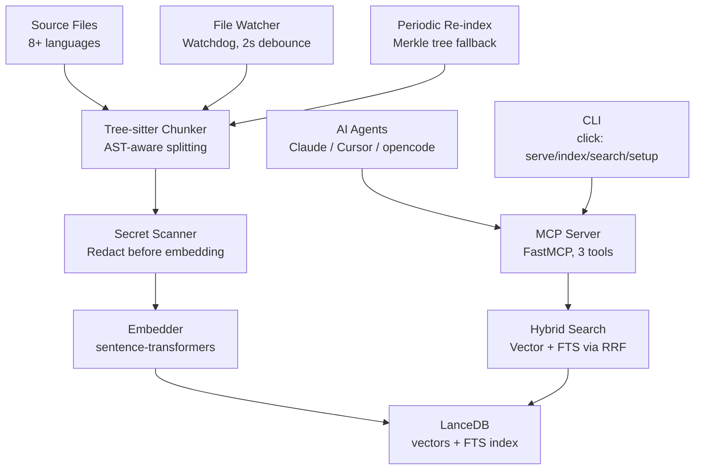

# Semantic Code Search

Local-first semantic code search engine with MCP server, live file watching, and AST-aware chunking via tree-sitter.

## Architecture



## Quick Start

```bash
uv sync
uv run code-index           # interactive setup on first run, then MCP server
uv run code-index index     # one-shot index
uv run code-index search --query "auth logic" --codebase my_project
uv run code-index setup     # re-run config setup
```

## Key Features

- **Tree-sitter AST chunking** for Python, JS/TS, Rust, Go, Java, C/C++ with smart splitting for oversized nodes
- **Hybrid search** -- vector similarity + full-text search merged with Reciprocal Rank Fusion (RRF)
- **Merkle tree incremental indexing** -- only re-indexes changed files
- **Live file watching** with debounced (2s) per-file updates + periodic Merkle re-index fallback
- **MCP server** for AI agent integration (Claude Code, Cursor, opencode)
- **Secret scanning and redaction** -- AWS keys, JWTs, private keys, high-entropy strings
- **Encrypted at rest** via Fernet + PBKDF2 (480k iterations)
- **One-command setup** with `.codeindex.yml` auto-discovery

## How It Works

Source files are parsed into ASTs via tree-sitter using a Strategy pattern (one parser class per language). Each chunk is a semantically meaningful unit (function, class, method). Oversized nodes are split at blank-line boundaries with the signature prepended as context. Tiny chunks below the token minimum are filtered out.

Chunks are embedded with `sentence-transformers` (`all-MiniLM-L6-v2`, 384-dim) and stored in LanceDB with a full-text search index. Search runs vector + FTS in parallel, merged via RRF (k=60).

A Merkle tree tracks per-file MD5 hashes for incremental updates. The file watcher reacts to changes in real-time (2s debounce), and a periodic re-index (every 5 min) catches anything the watcher misses.

## Supported Languages

| Language | Nodes Extracted |
|----------|----------------|
| Python | functions, async functions, classes, methods, docstrings |
| JS/TS | functions, classes, arrow functions, interfaces, types |
| Rust | functions, impl methods, structs, enums, traits |
| Go | functions, methods (receiver), structs, interfaces |
| Java | classes, methods, constructors, interfaces |
| C/C++ | functions, classes, structs |
| Other | Whole file |

## MCP Tools

| Tool | Description |
|------|-------------|
| `search_code_tool(query, codebase_name, n_results=3)` | Hybrid search returning top-N results |
| `list_codebases()` | List indexed codebases with chunk counts |
| `remove_codebase(codebase_name)` | Delete a codebase and its data |

## Configuration

`.codeindex.yml` is auto-discovered by walking up to the git root:

```yaml
codebases:
  - name: my_project
    root: ./src
extensions:
  - .py
  - .js
  - .ts
exclude:
  - node_modules
  - .venv
```

### Environment Variables

| Variable | Default | Description |
|----------|---------|-------------|
| `CODE_INDEX_DB_PATH` | `./code_index_db` | LanceDB persistence directory |
| `CODE_INDEX_EMBEDDING_MODEL` | `all-MiniLM-L6-v2` | Embedding model |
| `CODE_INDEX_N_RESULTS` | `3` | Default search result count |
| `CODE_INDEX_DEBOUNCE` | `2` | Watcher debounce (seconds) |
| `CODE_INDEX_CHUNK_MAX_TOKENS` | `220` | Max tokens per chunk before splitting |
| `CODE_INDEX_CHUNK_MIN_TOKENS` | `10` | Min tokens to keep a chunk |
| `CODE_INDEX_PERIODIC_REINDEX_SECONDS` | `300` | Periodic Merkle re-index interval (0 to disable) |
| `CODE_INDEX_DB_ENCRYPTION_KEY` | (auto-generated) | Fernet key for encryption at rest |
| `CODE_INDEX_ALLOWED_DIRS` | (cwd) | Allowed root directories |
| `CODE_INDEX_AUDIT_DIR` | (empty) | Enable audit logging when set |

## Testing

```bash
uv run pytest tests/ -v
```

87 tests covering chunking, database, search, config, encryption, path security, and secret scanning.

## Benchmark Results

Run the benchmark suite (220 natural language queries across 3 codebases):

```bash
uv run python -m code_index.benchmark
```

Compares semantic search vs grep vs glob. Results are written to `benchmark_results.md`.

Latest results:

| Metric | Semantic (LanceDB) | Grep | Glob |
|--------|---------------------|------|------|
| Top-1 Accuracy | 76.1% (166/218) | 4.1% (9/218) | 9.2% (20/218) |
| Top-3 Accuracy | 85.3% (186/218) | 10.1% (22/218) | 11.5% (25/218) |
| Top-5 Accuracy | 87.2% (190/218) | 14.7% (32/218) | 12.4% (27/218) |
| Avg Query Time | 15ms | 62ms | 2ms |

Semantic search achieves 18x higher top-1 accuracy than grep on natural language queries.

## Security

Built into every layer: encryption at rest (Fernet + PBKDF2), secret scanning (25+ patterns + Shannon entropy), path traversal prevention, input sanitization, symlink protection, optional audit logging, and optional model SHA-256 verification.
