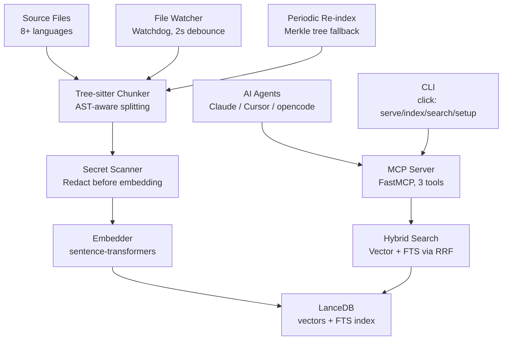

# code-index

Local-first semantic code search engine with tree-sitter AST chunking, hybrid search, live file watching, and an MCP server for AI agent integration.

- **Understands code** — tree-sitter AST parsing extracts functions, classes, methods (not just raw text)
- **Finds meaning** — semantic vector search combined with full-text via Reciprocal Rank Fusion (RRF)
- **Stays fresh** — live file watcher + periodic Merkle-tree re-indexing
- **Plugs into AI agents** — MCP server for Claude Code, Cursor, opencode and any MCP-compatible tool

---

## Quick Start

```bash
git clone <url>
cd codebase_indexer
uv sync

# Start the server — if no config, launches setup wizard automatically
uv run python -m code_index
# or: uv run code-index serve

# Search while the server runs (in another terminal)
uv run code-index search --query "api rate limiter" --codebase my-project
```

---

## Usage Guide

### 1. Install

```bash
git clone <url>
cd codebase_indexer
uv sync
```

### 2. Start the server

```bash
uv run python -m code_index
```

On first run there's no config yet, so the interactive setup wizard starts:

```
No .codeindex.yml found. Let's set one up.

==================================================
  codeindex — first-time setup
==================================================

  Detected git repo: /home/you/codebase_indexer

  Options:
  1) Index git repo root (auto-detected)
  2) Index current directory
  3) Enter paths manually

  Choose [1/2/3]:
```

Choose option 3 and type the path to the project you want to index (e.g. `~/my-project`).
The wizard writes `.codeindex.yml` and `.env`, then the server proceeds to index
everything and start listening for queries.

On subsequent runs, the config already exists and `serve` starts immediately.

### 3. Search

While the server is running, query from another terminal:

```bash
uv run code-index search --query "database pool" --codebase my-project
```

Or connect an AI agent (see MCP section below).

### 4. Other commands

```bash
# Configure a project non-interactively
uv run code-index setup ~/my-project

# One-shot index (no server)
uv run code-index index

# SSE server on a custom port
uv run code-index serve --transport sse --port 8080
```

---

## CLI Reference

### `code-index` (no subcommand)

Starts the MCP server (same as `code-index serve`). Auto-setup if no config found.

Use `code-index --help` to see all subcommands.

### `code-index serve`

Start the MCP server — index codebases, watch files, and serve search queries.

This is the default when running `code-index` or `python -m code_index` with no subcommand.

Reads `.codeindex.yml` from the current directory (walks up to git root).
If no config is found, launches the interactive setup wizard automatically.

```bash
code-index serve                         # start server (auto-setup if needed)
code-index serve --transport sse --port 8080
code-index serve --quick                 # skip initial index, build in background
```

**Options:**

| Flag | Description |
|------|-------------|
| `--transport` | `stdio` (default), `sse`, or `streamable-http` |
| `--host` | Bind address for SSE/HTTP (default: 127.0.0.1) |
| `--port` | Port for SSE/HTTP (default: 8000) |

**What happens:**

1. Loads config or launches setup wizard.
2. Indexes each codebase (full on first run, incremental after).
3. Starts the file watcher (2s debounce) for real-time updates.
4. Starts periodic Merkle re-index (every 300s, configurable).
5. Runs the MCP server with the chosen transport.

Leave this running while you work — it watches for changes and keeps the index fresh.

### `code-index index`

One-shot indexing without starting the server or file watcher.

Reads `.codeindex.yml` from the current directory (walks up to git root).
If no config is found, launches the interactive setup wizard automatically.

```bash
code-index index
```

**When to use:** CI pipelines, or re-indexing after config changes.

### `code-index search --query Q --codebase NAME`

Command-line search against an indexed codebase.

```bash
code-index search --query "database connection pool" --codebase myproject
code-index search --query "auth middleware" --codebase myproject --n-results 5
```

**Options:**

| Flag | Description |
|------|-------------|
| `--query` | Natural language search query (required) |
| `--codebase` | Codebase name (required) |
| `--n-results` | Number of results (default: 3) |

**Output:**

```
Query: "database connection pool"
============================================================
--- Result 1 ---
File:   src/db/pool.py
Line:   42
Name:   ConnectionPool
Type:   class
Score:  0.6821
Code:
class ConnectionPool:
    def __init__(self, min_size=5, max_size=20):
        self._pool = []
        self._min = min_size
        self._max = max_size
------------------------------------------------------------
```

### `code-index setup [PATH]`

Configure a project for indexing.

Creates `.codeindex.yml` and `.env` in the current directory. Required before
`serve` or `index`.

```bash
code-index setup ~/my-project     # specify path directly
code-index setup                   # interactive wizard
```

---

## Architecture



### Pipeline

1. **Chunking** — Source files are parsed into AST nodes via tree-sitter (one parser per language). Each node (function, class, method) becomes a chunk. Oversized nodes are split at blank-line boundaries with the function signature prepended for context. Tiny chunks below the token minimum are dropped.

2. **Secret scanning** — Each chunk is scanned for 25+ regex patterns (AWS keys, JWTs, private keys, etc.) plus Shannon entropy checks. Matches are redacted before embedding.

3. **Embedding** — Chunks are embedded using `sentence-transformers` with `all-MiniLM-L6-v2` (384-dim). The model is downloaded on first use and cached. Batch size defaults to 256; lower to 64 on low-memory machines.

4. **Storage** — Vectors and metadata are stored in LanceDB with a full-text search (FTS) index over the chunk text.

5. **Search** — Queries are embedded with the same model. Vector similarity + FTS results are merged via Reciprocal Rank Fusion (RRF, k=60).

6. **Incremental updates** — A Merkle tree tracks MD5 hashes per file. Changed/new files are re-chunked and re-embedded. The file watcher (watchdog, 2s debounce) catches real-time edits. A periodic full-tree scan runs every 300s as a safety net.

### Supported Languages

| Language | Extracted Nodes |
|----------|----------------|
| Python | functions, async functions, classes, methods, docstrings |
| JavaScript | functions, classes, arrow functions, methods |
| TypeScript | functions, classes, arrow functions, methods, interfaces, types |
| Rust | functions, impl methods, structs, enums, traits |
| Go | functions, methods (receiver), structs, interfaces |
| Java | classes, methods, constructors, interfaces |
| C/C++ | functions, classes, structs, methods |
| Other | Whole file |

---

## MCP Server (AI Agent Integration)

The MCP server exposes three tools for MCP-compatible agents.

### Tools

| Tool | Parameters | Returns |
|------|-----------|---------|
| `search_code_tool` | `query` (str), `codebase_name` (str), `n_results` (int, default 3) | Formatted results: file, line, name, type, score, code snippet |
| `list_codebases` | none | List of indexed codebase tables with chunk counts |
| `remove_codebase` | `codebase_name` (str) | Confirmation string |

### Transport Modes

There are two ways to connect:

**stdio** (default, for local agents) — the MCP server communicates over stdin/stdout. The agent launches the server as a subprocess.

**SSE / streamable-http** (for remote agents) — the MCP server listens on an HTTP endpoint. Start with `--transport sse --port 8080`.

### Connecting from AI Tools

The server runs as an SSE HTTP server. **Leave it running in a terminal** — it keeps the model warm so queries are instant.

#### Start the server

```bash
cd /path/to/codebase_indexer
uv run python -m code_index
```

#### Connect your agent

**Claude Code:**

```bash
claude mcp add code-index sse --url http://127.0.0.1:1337/sse
```

**opencode:**

Add to `~/.config/opencode/config.json`:

```json
{
  "mcpServers": {
    "code-index": {
      "transport": "sse",
      "url": "http://127.0.0.1:1337/sse"
    }
  }
}
```

**Cursor:**

1. Settings → Features → MCP Servers → Add new MCP Server
2. Name: `code-index`
3. Type: `sse`
4. URL: `http://127.0.0.1:1337/sse`

**Windsurf / Codeium:**

Add to `.codeium/windsurf.mcp.json`:

```json
{
  "mcpServers": {
    "code-index": {
      "type": "sse",
      "url": "http://127.0.0.1:1337/sse"
    }
  }
}
```

**Continue.dev:**

Add to `~/.continue/config.json`:

```json
{
  "experimental": {
    "mcpServers": {
      "code-index": {
        "transport": "sse",
        "url": "http://127.0.0.1:1337/sse"
      }
    }
  }
}
```

Once connected, your AI agent can search your codebase with natural language queries:
- "Find where the database connection pool is configured"
- "How does the authentication middleware work?"
- "Show me the API rate limiter implementation"

#### Connecting from another machine

Use the **LAN** address printed at startup (e.g., `http://172.16.1.102:1337/sse`). Replace `127.0.0.1` in the commands above with that address.

#### Troubleshooting

If you restart the server, you may need to restart your AI agent or reconnect (varies by tool). Some tools auto-reconnect to SSE endpoints.

## Configuration

### `.codeindex.yml`

Auto-discovered by walking up from cwd to the git root. Created by `code-index setup`.

```yaml
codebases:
  - name: my_project
    root: ./src

extensions:
  - .py
  - .js
  - .ts

exclude:
  - node_modules
  - .venv
  - __pycache__
```

| Field | Description |
|-------|-------------|
| `codebases` | List of codebases to index. Each has a `name` (used in search) and `root` (directory path, absolute or relative to config). |
| `extensions` | File extensions to include. Default: `.py .js .jsx .ts .tsx .md .txt .json .sql` |
| `exclude` | Directory/pattern exclusions. Default: `node_modules .venv __pycache__ .git` |

### Environment Variables

| Variable | Default | Description |
|----------|---------|-------------|
| `CODE_INDEX_DB_PATH` | `./code_index_db` | LanceDB persistence directory |
| `CODE_INDEX_EMBEDDING_MODEL` | `all-MiniLM-L6-v2` | HuggingFace model ID |
| `CODE_INDEX_EMBEDDING_MODEL_SHA256` | (empty) | Verify model integrity on download |
| `CODE_INDEX_EMBEDDING_OFFLINE` | `false` | Skip model download, use cached only |
| `CODE_INDEX_N_RESULTS` | `3` | Default number of search results |
| `CODE_INDEX_DEBOUNCE` | `2` | File watcher debounce in seconds |
| `CODE_INDEX_CHUNK_MAX_TOKENS` | `220` | Max tokens per chunk (approximate, 4 chars/token) |
| `CODE_INDEX_CHUNK_MIN_TOKENS` | `10` | Drop chunks below this token count |
| `CODE_INDEX_CHARS_PER_TOKEN` | `4` | Character-to-token ratio for chunk sizing |
| `CODE_INDEX_PERIODIC_REINDEX_SECONDS` | `300` | Full Merkle re-index interval (0 to disable) |
| `CODE_INDEX_MAX_FILE_SIZE_MB` | `10` | Skip files larger than this |
| `CODE_INDEX_DB_ENCRYPTION_KEY` | (auto-generated) | Fernet key for encryption at rest |
| `CODE_INDEX_ALLOWED_DIRS` | (empty) | Restrict indexed paths (comma-separated). Empty = allow any non-sensitive path. |
| `CODE_INDEX_AUDIT_DIR` | (disabled) | Directory for JSONL audit logs |
| `CODE_INDEX_EMBEDDING_CACHE_SIZE` | `512` | LRU cache size for the embedder |
 | `CODE_INDEX_EMBEDDING_BATCH_SIZE` | `256` | Embedding batch size. Lower to 64 on low-memory machines. Higher = faster on modern CPUs/Apple Silicon. |

---

## Security

Built into every layer of the pipeline:

| Layer | Mechanism |
|-------|-----------|
| Secret scanning | 25+ regex patterns + Shannon entropy (>=4.2 bits) redact secrets before embedding |
| Encryption at rest | Fernet (AES-128-CBC) with PBKDF2 (480k iterations) for database files |
| Path traversal prevention | Blocks `..` components, symlinks, and sensitive system directories (`/etc`, `/proc`, `~/.ssh`, etc.) |
| Input sanitization | Query and codebase name validated against allowlisted patterns |
| Model integrity | Optional SHA-256 verification of downloaded model weights |
| Audit logging | Optional JSONL audit trail for searches, errors, and security events |

---

## Workflows

### Live development with auto-reindexing

```bash
# First time: start the server, it prompts for the project path
uv run code-index serve

# Subsequent sessions: config exists, starts immediately
uv run code-index serve
```

### One-shot indexing (CI)

```bash
echo "codebases:
  - name: my-app
    root: /path/to/app
extensions:
  - .py
exclude:
  - node_modules" > .codeindex.yml

uv run code-index index
```

### Search via CLI

While the server is running:

```bash
uv run code-index search --query "how does the retry logic work" --codebase my-app --n-results 5
```

### Index multiple projects

Edit `.codeindex.yml` to add multiple codebases:

```yaml
codebases:
  - name: frontend
    root: ./packages/frontend
  - name: backend
    root: ./packages/backend
  - name: shared
    root: ./packages/shared
```

---

## Benchmark Results

220 natural language queries across 3 codebases:

| Metric | Semantic (LanceDB) | Grep | Glob |
|--------|---------------------|------|------|
| Top-1 Accuracy | 67.0% (146/218) | 5.0% (11/218) | 10.6% (23/218) |
| Top-3 Accuracy | 83.5% (182/218) | 11.9% (26/218) | 14.7% (32/218) |
| Top-5 Accuracy | 86.2% (188/218) | 17.0% (37/218) | 16.1% (35/218) |
| Avg Query Time | 15ms | 24ms | 2ms |

Run locally:

```bash
uv run python -m code_index.benchmark
```

---

## Testing

```bash
uv run pytest tests/ -v
```

50+ tests covering chunking, database, search, config, encryption, path security, secret scanning, and audit logging.

---

## Development

### Project Layout

```
code_index/
├── cli.py             # Click CLI (serve/index/search/setup)
├── config.py          # Environment variable bindings
├── config_loader.py   # YAML config discovery and parsing
├── config_setup.py    # Interactive setup wizard
├── chunker.py         # Tree-sitter chunking + smart splitting
├── database.py        # LanceDB client + Merkle tree indexer
├── embedder.py        # sentence-transformers wrapper
├── search.py          # Hybrid search (vector + FTS, RRF merge)
├── watcher.py         # File watcher + periodic re-index daemon
├── path_security.py   # Path traversal prevention
├── query_sanitizer.py # Input validation
├── encryption.py      # Fernet + PBKDF2 at-rest encryption
├── secret_scanner.py  # Secret pattern detection + redaction
├── audit.py           # Optional JSONL audit logging
├── benchmark.py       # Benchmark runner
└── parsers/           # Strategy-pattern tree-sitter parsers
    ├── languages.yaml # Extension-to-language mapping
    ├── base.py        # Abstract base parser
    ├── python_parser.py
    ├── javascript_parser.py
    ├── typescript_parser.py
    ├── rust_parser.py
    ├── go_parser.py
    ├── java_parser.py
    ├── cpp_parser.py
    └── c_parser.py
```

